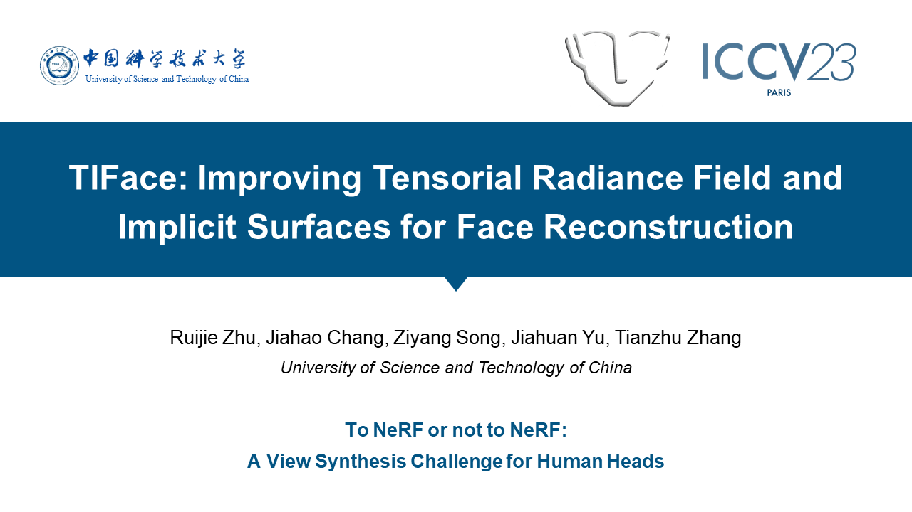

<!-- <p align="center">
   -->
  
  <h3 align="center"><strong>TIFace: Improving Facial Reconstruction through Tensorial Radiance Fields and Implicit Surfaces</strong></h3>

  <p align="center">
    <a href="https://ruijiezhu94.github.io/ruijiezhu/">Ruijie Zhu</a>,</span>
    <a href="https://scholar.google.com/citations?user=HA5zLp4AAAAJ&hl=en">Jiahao Chang</a>,</span>
    <a href="https://indu1ge.github.io/ziyangsong">Ziyang Song</a>,</span>
    <a href="https://monsoon-cs.moe/about/">Jiahuan Yu</a>,</span>
    <a href="http://staff.ustc.edu.cn/~tzzhang/">Tianzhu Zhang</a>
    <br>
    University of Science and Technology of China
    <br>
    <b>1st place solution in View Synthesis Challenge for Human Heads @ ICCV2023</b>

</p>

<div align="center">
 <!-- <a href=''></a> &nbsp;&nbsp;&nbsp;&nbsp;&nbsp; -->
<a href='https://arxiv.org/abs/2312.09527'></a> &nbsp;&nbsp;&nbsp;&nbsp;&nbsp;
 <a href='https://youtu.be/QRuVvtpoeVM'></a> &nbsp;&nbsp;&nbsp;&nbsp;&nbsp;
 <a href=''></a> &nbsp;&nbsp;&nbsp;&nbsp;&nbsp;
</div>


[](https://youtu.be/QRuVvtpoeVM)

> This video describes our solution that secured 
the first place in the "View Synthesis Challenge for Human Heads (VSCHH)" at the ICCV 2023 workshop. Go to Youtube to see our talk!

## News
- **18 Dec. 2023**: The code is now available.
- **18 Dec. 2023**: The extended challenge report was released on [arXiv](https://arxiv.org/abs/2312.09527).
- **2 Oct. 2023**: We won the championship 🏆 in [View Synthesis Challenge for Human Heads](https://sites.google.com/view/vschh/home) @ ICCV2023.


## Installation

### Data config
We provide an example scene of ILSH dataset on [Google Drive](https://drive.google.com/file/d/1LBTizKvelZ-_9J-BPHf_i29IrajzSDaf/view?usp=drive_link). For full dataset download, please refer to the instructions on [CodaLab](https://codalab.lisn.upsaclay.fr/competitions/14427#learn_the_details-terms_and_conditions).
> Note that you need to follow the process (sign and email the EULA form) to access the full ILSH dataset. 

Put the example data into ./data, the files should be organized as:
```
data/nerf_datasets/ILSH/chaPhase/002_00
├── images
├── images_4x
├── masks
├── poses_bounds_test.npy
├── poses_bounds_train.npy
├── sam_mask
├── transforms_test.json
├── transforms_train.json
└── vit_mask
```

### Environment Config
Please follow the instructions of [T-Face](./T-Face/README.md) and [I-Face](./I-Face/README.md).


## Running

We provide example bash commands to run training or testing. Please modify these files according to your own configuration before running.

### Training

T-Face:

```bash
# single scene
cd T-Face
python train.py --config configs/islh_mask.txt \
    --datadir ./data/nerf_datasets/ILSH/chaPhase/002_00 \
    --expname tensorf_ILSH_VM_002_00_vit_mask
```

```bash
# multiple scenes
cd T-Face
bash train_all.sh
```

I-Face:

```bash
# single scene
cd I-Face
python launch.py --config configs/neus-blender_ilsh.yaml \
    —gpu 0 \
    --train dataset.scene=\'002_00\' \
    tag=new 
```

```bash
# multiple scenes
cd I-Face
bash train_all_neus.sh
```

### Validation
Pack your validation results and submit to [CodaLab](https://codalab.lisn.upsaclay.fr/competitions/16058) for validation.

### Testing
Pack your testing results and submit to [CodaLab](https://codalab.lisn.upsaclay.fr/competitions/14427) for evaluation.

## Bibtex

If you find our work useful in your research, please consider citing:

```
@article{zhu2023tiface,
    title={TIFace: Improving Facial Reconstruction through Tensorial Radiance Fields and Implicit Surfaces}, 
    author={Zhu, Ruijie and Chang, Jiahao and Song, Ziyang and Yu, Jiahuan and Zhang, Tianzhu},
    journal={arXiv preprint arXiv:2312.09527},
    year={2023}
}
```

and

```
@InProceedings{Jang_2023_VSCHH,
    author    = {Jang, Youngkyoon and Zheng, Jiali and Song, Jifei and Dhamo, Helisa and P\'erez-Pellitero, Eduardo and Tanay, Thomas and Maggioni, Matteo and Shaw, Richard and Catley-Chandar, Sibi and Zhou, Yiren and Deng, Jiankang and Zhu, Ruijie and Chang, Jiahao and Song, Ziyang and Yu, Jiahuan and Zhang, Tianzhu and Nguyen, Khanh-Binh and Yang, Joon-Sung and Dogaru, Andreea and Egger, Bernhard and Yu, Heng and Gupta, Aarush and Julin, Joel and Jeni, L\'aszl\'o A. and Kim, Hyeseong and Cho, Jungbin and Hwang, Dosik and Lee, Deukhee and Kim, Doyeon and Seo, Dongseong and Jeon, SeungJin and Choi, YoungDon and Kang, Jun Seok and Seker, Ahmet Cagatay and Ahn, Sang Chul and Leonardis, Ales and Zafeiriou, Stefanos},
    title     = {VSCHH 2023: A Benchmark for the View Synthesis Challenge of Human Heads},
    booktitle = {Proceedings of the IEEE/CVF International Conference on Computer Vision (ICCV) Workshops},
    month     = {October},
    year      = {2023},
    pages     = {1121-1128}
}
```

## Acknowledgements

The code is based on [TensoRF](https://github.com/apchenstu/TensoRF) and [instant-nsr-pl](https://github.com/bennyguo/instant-nsr-pl). The mask generation uses [ViTMatte](https://github.com/hustvl/ViTMatte). 
